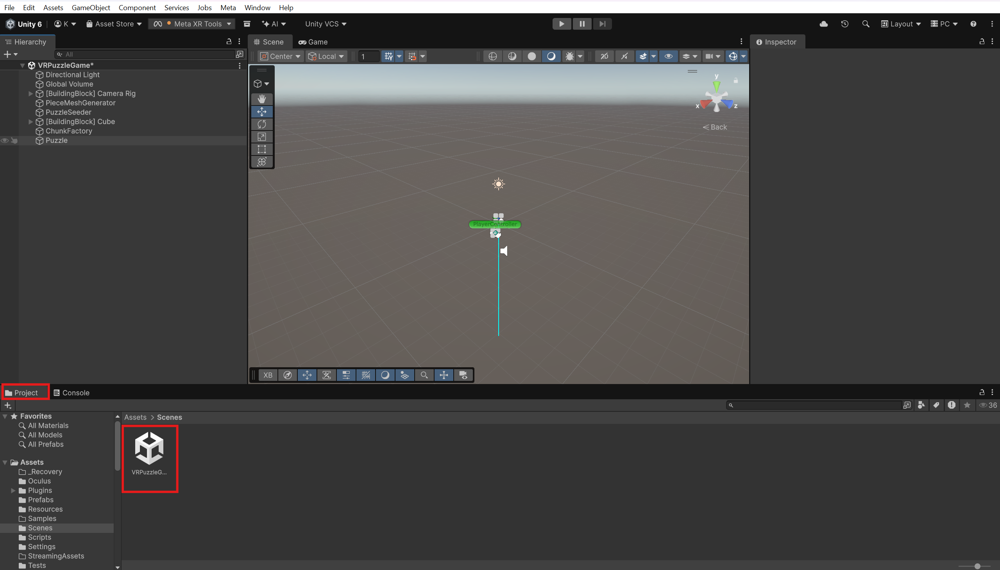
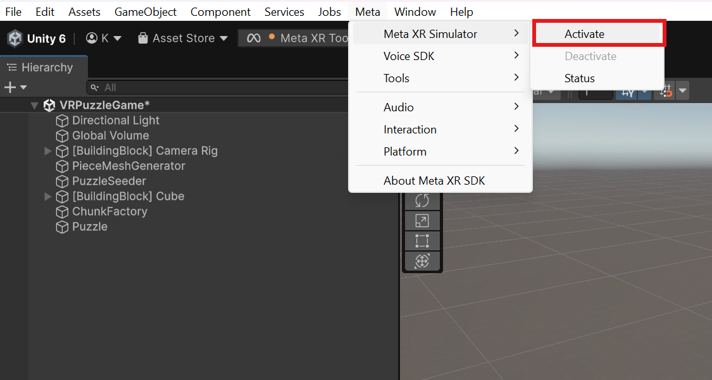
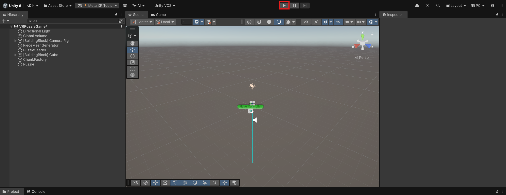

# Overview

This repostiory contains a VR Puzzle game written with Unity and the Meta XR All-In-One SDK.

# Installation

### Required OS

Windows 10 or higher (64-bit)
macOS Sierra 10.10 or higher may work, however it has not been tested

### Programs Needed

To get the program running, the following software is needed:

* [Unity Hub](https://unity.com/download)
* [Unity Editor Version 6000.3.6f1](https://docs.unity3d.com/hub/manual/AddEditor.html)

If you have a Meta Quest headset, you will want to install [Meta Horizon Link](https://www.meta.com/help/quest/1517439565442928/) so you can link your headset to your computer

You can also simulate a headset by installing [Meta XR Simulator](https://developers.meta.com/horizon/downloads/package/meta-xr-simulator/)

## Project Setup

Firstly, clone the repository:

```bash
git clone https://github.com/kylelovestoad/VRPuzzleGame.git
```
Then open Unity Hub and select `Add > Add project from disk`


Select the directory for the cloned repository 

Then, the project should appear for you within Unity Hub's project list

Now, open the project to be able to run the game in the editor

### With Meta Quest

If you have a Meta Quest headset, you will want to enter developer mode so that you can run the game through the headset

You will also need a cable to connect the headset to your computer running Unity

More information can be found [here](https://developers.meta.com/horizon/documentation/android-apps/enable-developer-mode/)

# Running

If you are not in the Main Scene, `VRPuzzleGame`, navigate to scenes through the "Project" tab on the bottom
and double click on the `VRPuzzleGame` file



### With Meta Quest

You will want to connect your Meta Quest in developer mode to your computer running Unity.

The headset should ask if you want to enable linking. Select enable
You will then be connected to your computer

More info about this can be found [here](https://www.meta.com/help/quest/509273027107091/)

### Without Meta Quest

Activate the simulator by going to `Meta > Meta XR Simulator > Activate`



### Final Steps

Finally, click the "Play" button at the top of the screen to start the game!




# Project Structure

### Scenes
Navigate to `Assets/Scenes` to find our game scenes.

### Scripts
Navigate to `Assets/Scripts` to find the game scripts.

### Unit Tests
Navigate to `Assets/Tests` to find the unit tests.

The Coverage report is located in the repo root under the folder CoverageReport

#### To Run the Unit Tests with Coverage:

First enable coverage:
* In the Unity Editor, go to Window -> Analysis -> Code Coverage.
* Then Click the check box to enable Code Coverage

Next Run the tests:
* In the Unity Editor, go to Window -> General -> Test Runner.
* Then it should show a list of all the Unit tests which you can click to run them all or run specific ones
